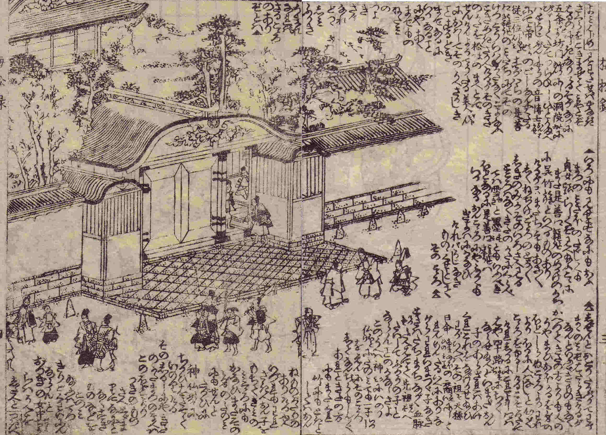

# Japanese Classic Language Recognition Project

## Context
Woodcut printing technology helped Japanese publication industly leap in 17-18th centuries, and we saw numerous amount of books printed in Edo period. While it is critical to read them to understand the culture of the period especially that of inclusive social classes (i.e. not only that among sophisticated and wealthy people), those prints need some (but not expert) knowledge to read partly due to different styles and characters. Recently some researchers started to apply ML/DL techniques in reading Japanese classics and we are seeing some progress in make those prints available in easily legible formats for general public

## This Project
This project is aiming to detect characters in a woodcur print from 18th century Japan (19th century reprint) and label/classify them

